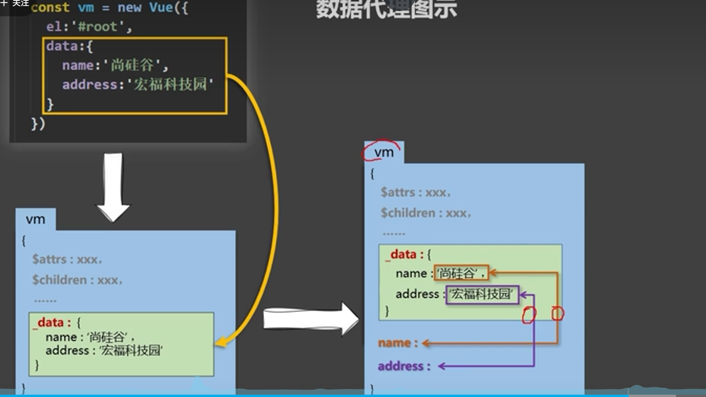
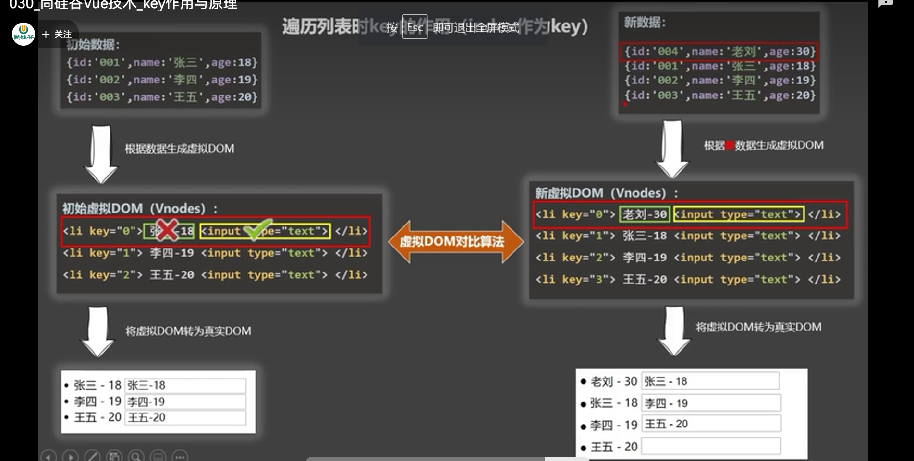
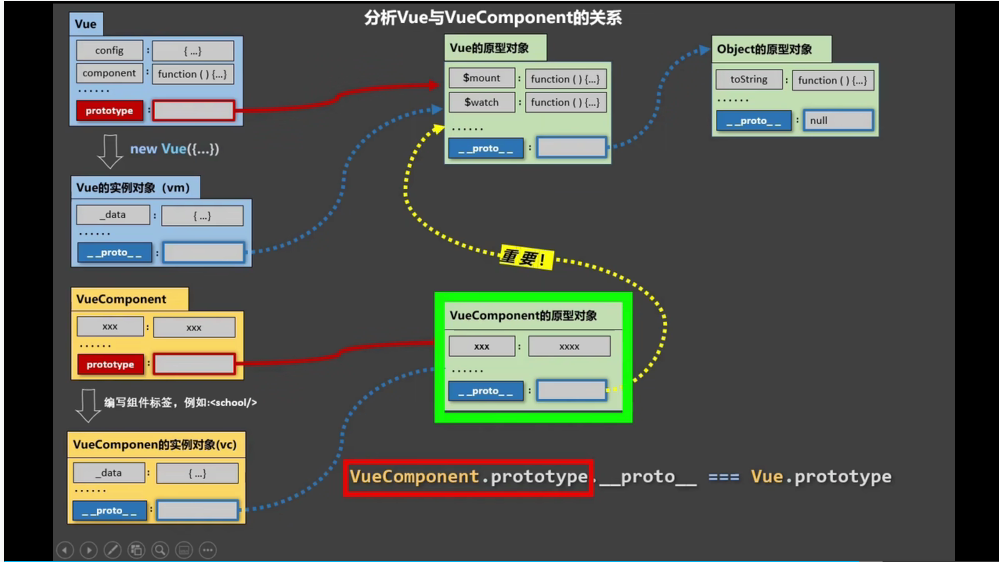

# vue的很多知识 注释在了代码里面 翻翻找找
# vue的特点
1 组件化 2 声明式
# 第一个vue程序
```
1 写在html后面 使得加载到DOM后再绑定上去
2 {{}} 里面可以写js 表达式 以及 Vue对象中 存储的所有内容
3 一个vue对象绑定一个DOM
4 子DOM和孙DOM都能拿到
5 个标签属性绑定时候 需要用v-bind: 或:来进行 例如(引号同{{}})
```python
<!--绑定到url上-->
<a v-bind:href="url">测试一下属性绑定</a>
<a :href="url">测试一下属性绑定</a>
```
# 数据代理
理解:在脚本语言中，非常适合搞数据代理。理解思想
看代码,关键是在使用属性的时候默认调用get set 方法,在get和set中进行代理
这段简短的代码 可以使得person中的name 属性代理了data中的name的属性
```javascript
 data:{
        name:'lxp'
        age:'18'
    }
    person:{

    }
    Object.defineProperty(person,'name',{
         set(value){
            data.name = value
         },
         get(){
            return data.name
         }
    })
```
在vue中 vue对象代理了你传入的data数据,将data保存在_data中，然后用如上的方法用vue对象代理_data对象



# 函数写法
vue管理的函数写成普通函数，不是vue管理的函数写成箭头函数,这样this会指向vm(vue对象)

# 列表渲染中 key属性的作用
 1 key属性 与vue的比对算法有关 如果不写 默认是遍历产生的下标。
 2 在列表中数据变化时候,vue先进行比对，然后再渲染成真实的节点
 3 当key一致的时候 vue会复用原来的节点,只改变节点中的数据。不一样的时候会新产生节点。


 4另外 节点中有输入框的时候 用唯一标识作为key 而不是index下标
 </br>
 

 ### vue组件原型图
 

 # Vue的单文件组件
 一个school.vue 一个文件里面写组件 组件的名字一般和文件同名
 组件中可以写结构(html) 样式(css) 控制(js) 
 vc = Vue.extend({}) 定义组件可以简写 vc = {} vc中只写数据 方法调用返回Vuecompoent让vue去执行 
 将组件汇总到Vue中然后搞
 看懂组件/单文件组件 下所有文件的写法

 # 脚手架
脚手架会将.vue文件搞成浏览器可以认识的文件
